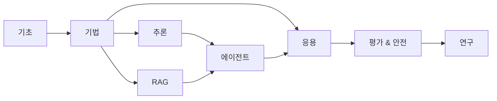

# 프롬프트 엔지니어링 가이드

대형 언어 모델(LLM)의 능력을 최대한 활용하기 위한 체계적 학습 자료입니다. 프롬프트 엔지니어링의 기본부터 고급 기법까지, 2026년 2월 기준 최신 모델(GPT-5.4, Claude 4.6, Gemini 2.5 Pro)에 맞춰 작성되었습니다.

본 가이드는 [Prompt Engineering Guide](https://www.promptingguide.ai/)의 연구 자료를 기반으로, 한국어 사용자를 위해 실전 예제와 함께 재구성한 것입니다.

---

## 구성

-   :material-book-open-variant:{ .lg .middle } **기초 (Foundations)**

    ---

    프롬프트 엔지니어링의 기본 개념, 요소, 설정, 그리고 주요 모델별 활용법을 다룹니다.

    [:octicons-arrow-right-24: 기초 보기](foundations/index.md)

-   :material-tools:{ .lg .middle } **기법 (Techniques)**

    ---

    Zero-shot, Few-shot, Chain-of-Thought 등 핵심 프롬프팅 기법을 실습 예제와 함께 학습합니다.

    [:octicons-arrow-right-24: 기법 보기](techniques/index.md)

-   :material-head-cog:{ .lg .middle } **추론 (Reasoning)**

    ---

    LLM의 추론 능력을 극대화하는 고급 방법론과 최신 연구 동향을 다룹니다.

    [:octicons-arrow-right-24: 추론 보기](reasoning/index.md)

-   :material-database-search:{ .lg .middle } **RAG & 지식 시스템**

    ---

    검색 증강 생성(RAG)의 원리, 구현, 그리고 환각 방지 전략을 학습합니다.

    [:octicons-arrow-right-24: RAG 보기](rag/index.md)

-   :material-robot:{ .lg .middle } **에이전트 (Agents)**

    ---

    AI 에이전트의 아키텍처, 함수 호출, 컨텍스트 엔지니어링을 체계적으로 다룹니다.

    [:octicons-arrow-right-24: 에이전트 보기](agents/index.md)

-   :material-application-brackets:{ .lg .middle } **응용 (Applications)**

    ---

    코딩, 데이터 생성, 분류, 요약 등 실무 프롬프팅 패턴과 사례를 학습합니다.

    [:octicons-arrow-right-24: 응용 보기](applications/index.md)

-   :material-shield-check:{ .lg .middle } **평가 & 안전 (Evaluation)**

    ---

    적대적 프롬프팅, 편향, 사실성 검증 등 안전하고 신뢰할 수 있는 AI 사용법을 다룹니다.

    [:octicons-arrow-right-24: 평가 보기](evaluation/index.md)

-   :material-flask:{ .lg .middle } **연구 (Research)**

    ---

    최신 논문과 연구 동향, 그리고 프롬프트 엔지니어링의 미래 방향을 탐구합니다.

    [:octicons-arrow-right-24: 연구 보기](research/index.md)

---

## 학습 로드맵

**입문자**: 기초 → 기법 → 응용 순서로 학습하세요.

**중급자**: 추론, RAG, 에이전트를 병렬로 학습한 후 응용으로 넘어가세요.

**시험 준비**: 각 페이지의 "시험 포인트" 섹션에 집중하세요.
